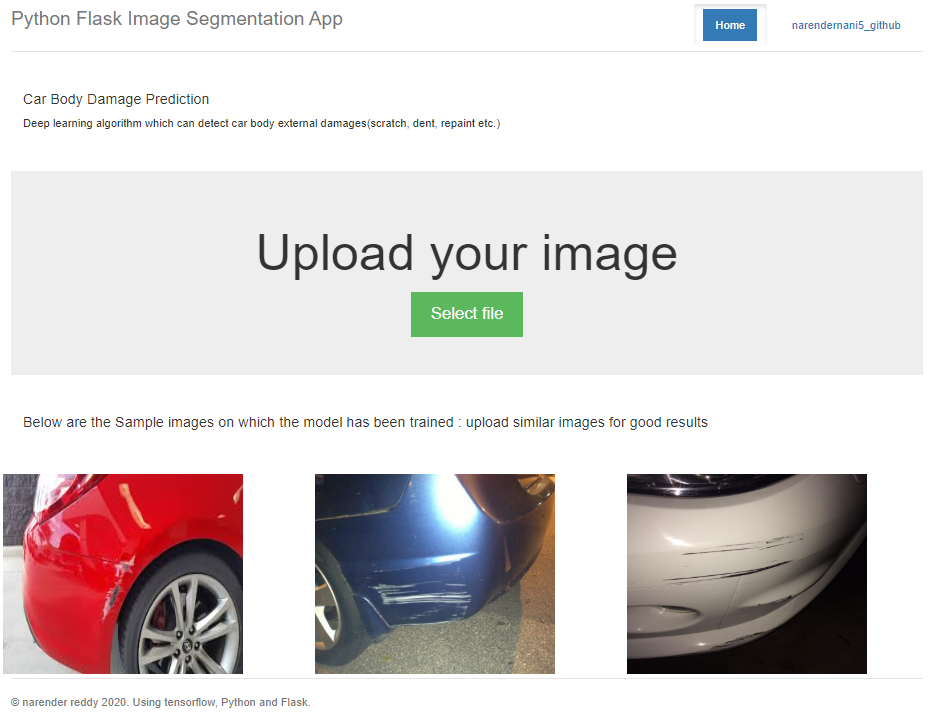
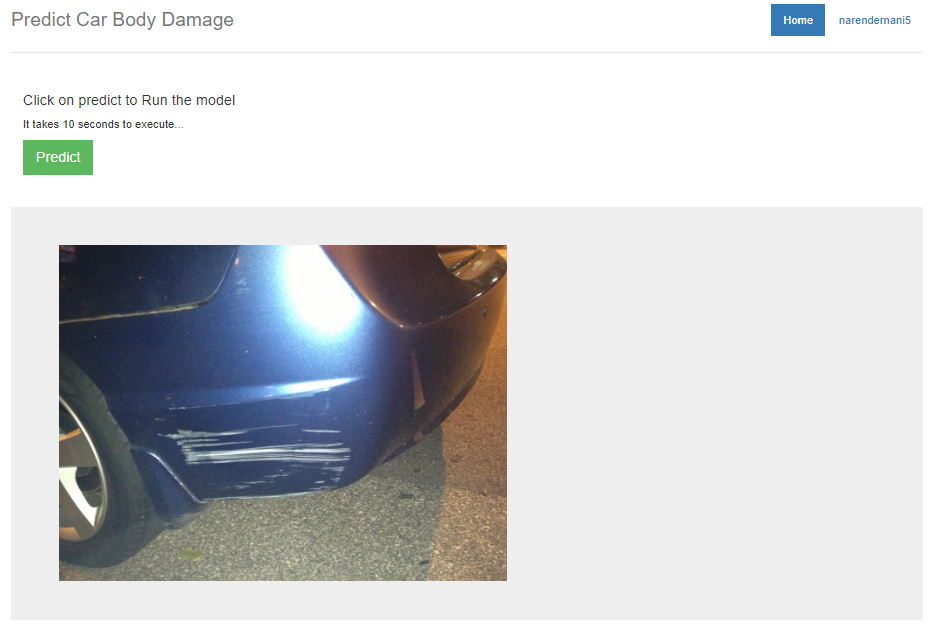
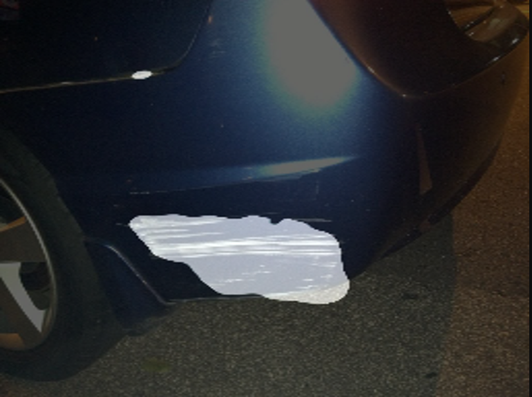

# Car-Body-Damage-Detection
Unet, Unet++ Implementation

Blog Link: https://medium.com/@narender.buchireddy/car-body-damage-detection-u-net-u-net-implementation-a-case-study-759b408e2c1f

## Introduction
In used car industry(both marketplace and brick and mortar dealers), apart
from car’s functionality and equipment availability and healthiness, which only can be accessed by test drive/manual inspection, car body external damages(scratch, dent, repaint, etc.) play a vital role to decide accurate pricing of the vehicle. In most of the cases, these damages are detected
and assessed manually from the car images during the car evaluation process. However, the latest computer vision frameworks can detect the damage location on the car body and help pricers to quantify the damage without much manual intervention.

## Problem description
Developing a deep learning algorithm that can detect car body external damages(scratch, dent, repaint etc.) and help pricers to quantify the damage without much manual intervention. This concept will also help car insurers in assessing the damage automatically and in processing claims faster.

## Objectives
1. Locate the Damage.
2. Maximize Dice coefficient

# Web Application
## 1. Home Page

## 2. Upload image

## 3. Predicted image

#### Source:  https://github.com/gxercavins/image-api
Thanks to gxercavins for the web application
